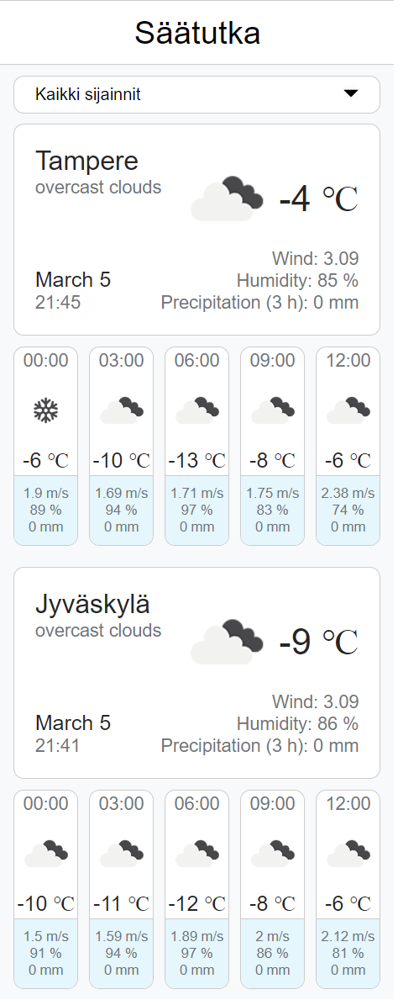

# Säätutka APP

## Table of Contents
* [Overview](#overview)
* [Features](#features)
    * [Dropdown selector](#dropdown-selector)
    * [Current weather](#current-weather)
    * [Forecast](#forecast)
* [OpenWeatherMap API](#openweathermap-api)
* [Setting-up API Key](#setting-up-api-key)
* [Design and implementation choices](#design-and-implementation-choices)
    * [Abstarction and configuration](#abstarction-and-configuration)
    * [State management](#state-management)
* [Available scripts](#available-scripts)

## Overview

Säätutka is a React SPA that allows users to search for and view the current weather and 3-hour interval forecasts for specified locations. The app uses OpenWeatherMap API to retrieve weather data and displays it in a user-friendly interface. With Säätutka, users can stay up-to-date with the latest weather information in their area and plan their day accordingly.

## Running the application

First set up the API Key (see  [setting-up API Key](#setting-up-api-key)).
Then you can run the application in server mode with script 'npm run start'  or in production mode by first building with script with 'npm run build' and then serving the build with script 'npm run serve'. See more scripts at [available scripts](#available-scripts).

## Features

### Dropdown selector

Dropdown selector makes it possible to choose between showing all the locationas simultaneously or in location at a time.

### Current weather

Big container with the name of the location contains the current weather data provided by the API.

### Forecast

Smaller containers are tied to the current weather container above them and display the upcoming weather forecasts in 3 hour intervals.



## OpenWeatherMap API

This app gathers it data from OpenWeatherMap. It is a widely used weather API for all sized projects and provides nowcasts and forecasts around the globe in hyperlocal minutely manner. 

Free subscription permits 60 API calls per minute and three hour forecast. Professional subscriptions are available for bigger needs.

See more at https://home.openweathermap.org/api.

## Setting up API Key

App uses react-dotenv to store appid more securely.

1. Sign up to https://home.openweathermap.org
2. Create API key at https://home.openweathermap.org/api_keys (see more information at https://openweathermap.org/appid)
3. Create .env file at the root directory (same as package.json)
4. Save the api key as APPID in .env file

The contents of your .env file should look like this:

```json
APPID=<YOUR_API_KEY>
```

## Design and implementation choices

The app uses React framework on top of vanilla JavaScript to create better frontend applications with less complexity.

### Abstarction and configuration

Locations, utilities and other useful content has been implemented in reusable files to ease configuring and expanding this software. The list of locations can be found in ./src/constants/locations.json. Appending to the list of values will add it to the app.

Note that some constants are bundled in ./src/constants/constants.js as the amount does not justify cluttering the working tree.

### State management

As the app has very minimal prop drilling I chose not to implement state management library such as Redux as implementing it would add unnecessary complexity. Should this app scale moderately bigger, a state management library could come in handy and proper notification system about e.g. fetching errors could be implemented along with it. For now I see no benefit to create multiple files to handle a few states.

### Icons

Icons are provided from OpenWeatherMap API where icon codes from responses can be directly utilized.

## Available Scripts

In the project directory, you can run:

### `npm start`

Runs the app in the development mode.\
Open [http://localhost:3000](http://localhost:3000) to view it in your browser.

The page will reload when you make changes.\
You may also see any lint errors in the console.

### `npm test`

Launches the test runner in the interactive watch mode.\
See the section about [running tests](https://facebook.github.io/create-react-app/docs/running-tests) for more information.

### `npm run build`

Builds the app for production to the `build` folder.\
It correctly bundles React in production mode and optimizes the build for the best performance.

The build is minified and the filenames include the hashes.\
Your app is ready to be deployed!

See the section about [deployment](https://facebook.github.io/create-react-app/docs/deployment) for more information.

### `npm run eject`

**Note: this is a one-way operation. Once you `eject`, you can't go back!**

If you aren't satisfied with the build tool and configuration choices, you can `eject` at any time. This command will remove the single build dependency from your project.

Instead, it will copy all the configuration files and the transitive dependencies (webpack, Babel, ESLint, etc) right into your project so you have full control over them. All of the commands except `eject` will still work, but they will point to the copied scripts so you can tweak them. At this point you're on your own.

You don't have to ever use `eject`. The curated feature set is suitable for small and middle deployments, and you shouldn't feel obligated to use this feature. However we understand that this tool wouldn't be useful if you couldn't customize it when you are ready for it.

### `npm run serve`

Runs the built app for production from the `build` folder using the `serve` package.
Open http://localhost:5000 to view it in your browser.

### `npm run build` fails to minify

This section has moved here: [https://facebook.github.io/create-react-app/docs/troubleshooting#npm-run-build-fails-to-minify](https://facebook.github.io/create-react-app/docs/troubleshooting#npm-run-build-fails-to-minify)
